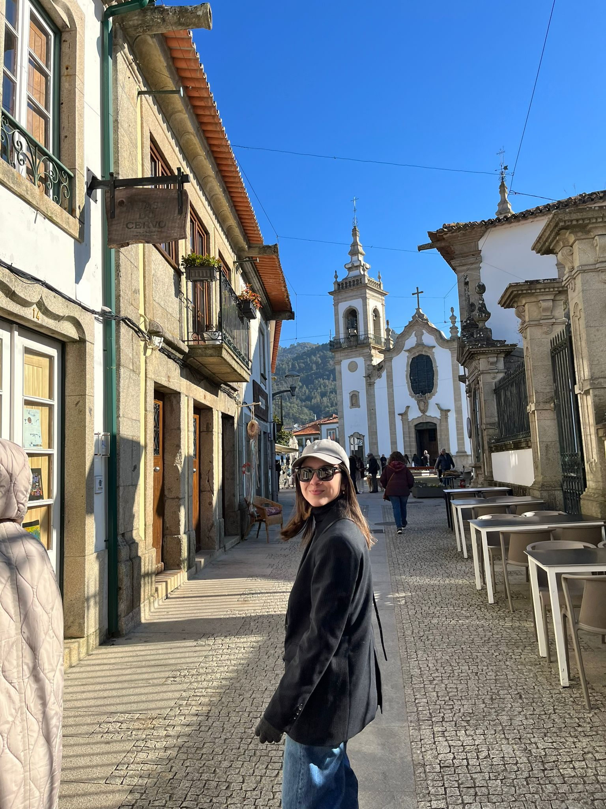
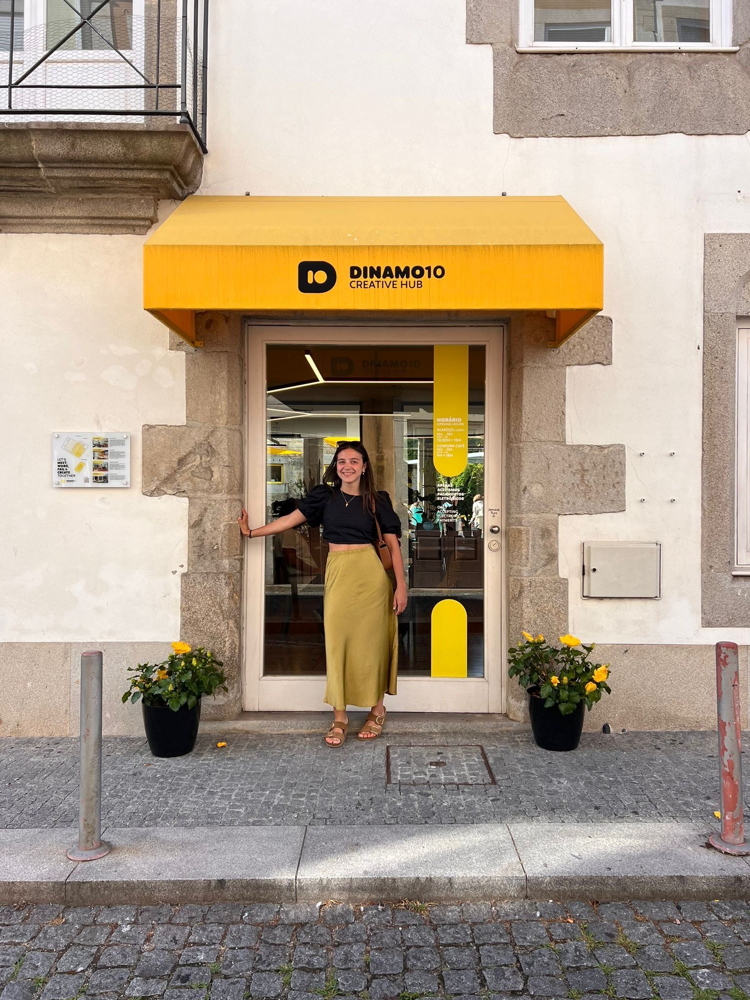
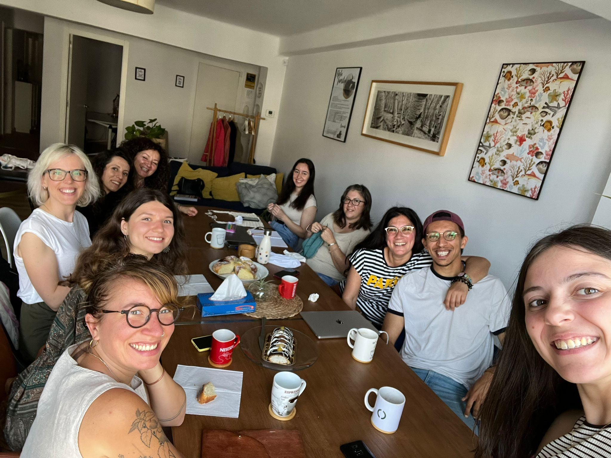
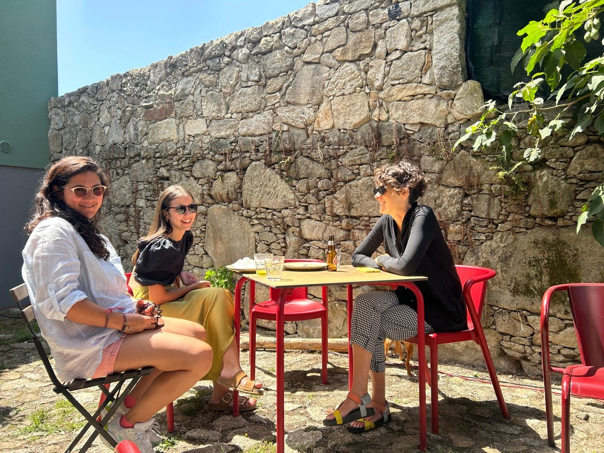

# Carmen Iglesias Limeres, de prácticas a profesional.

Hablamos de Carmen. Carmen empezó en la familia Arroelo en abril de 2023. Cuando inició … [Leer más](https://espacioarroelo.es/carmen-iglesias-limeres-de-practicas-a-profesional/)

---

## Hablamos de Carmen.

Carmen empezó en la familia Arroelo en abril de 2023.

Cuando inició sus prácticas como estudiante de asistencia a la dirección en Espacio Arroelo, desde el primer día, quisimos que fuera recibida con calidez y apoyo por parte de sus compañeros y superiores, lo que hizo que su transición de estudiante a profesional fuera mucho más fluída de lo que esperaba.

Durante las prácticas, Carmen tuvo la oportunidad de aprender y crecer en un entorno laboral real. Desde la gestión de agendas hasta la preparación de informes, cada tarea le permitió aplicar lo que había aprendido en sus estudios y adquirir nuevas habilidades.

Pero lo más importante fue el ambiente de colaboración y mentoría en la empresa. Sus compañeros y superiores estaban siempre dispuestos a compartir su conocimiento y brindar orientación, lo cual contribuyó enormemente al desarrollo profesional.

## ¿Y después, qué?

Al finalizar las prácticas, Arroelo no dudó en ofrecerle un puesto en esta gran familia. <<Fue un momento emocionante y gratificante >>, dice Carmen. 

Significaba que su trabajo y dedicación habían sido reconocidos. Pero también significaba mucho más que eso: significaba que había encontrado un lugar donde podía seguir creciendo y contribuyendo con su trabajo.

Desde entonces, ha seguido creciendo en su rol como asistente de dirección, participando en numerosos proyectos tanto para [Espacio Arroelo](https://espacioarroelo.es) como para [Anceu](https://anceu.com).

Además, durante 6 meses, ha participado en el programa [Erasmus for Young Entrepreneurs](https://www.erasmus-entrepreneurs.eu/index.php?lan=es), en el coworking Dinamo10, en Portugal. Una experiencia única que le brindó la oportunidad de colaborar con emprendedores en otros países, aprender nuevas perspectivas y adquirir habilidades que nunca hubiera tenido la oportunidad de desarrollar de otra manera.

Fue un período enriquecedor que amplió sus horizontes y le permitió seguir creciendo tanto personal como profesionalmente.

Cada día es una nueva oportunidad para aprender algo nuevo. 

