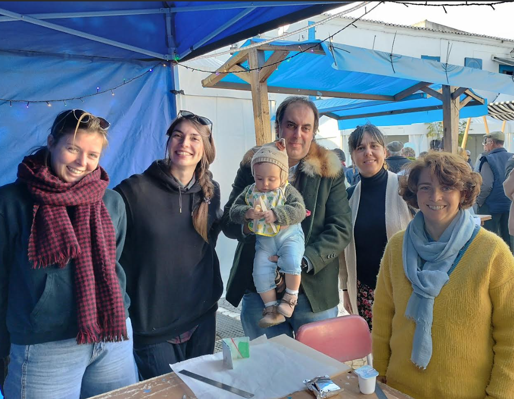
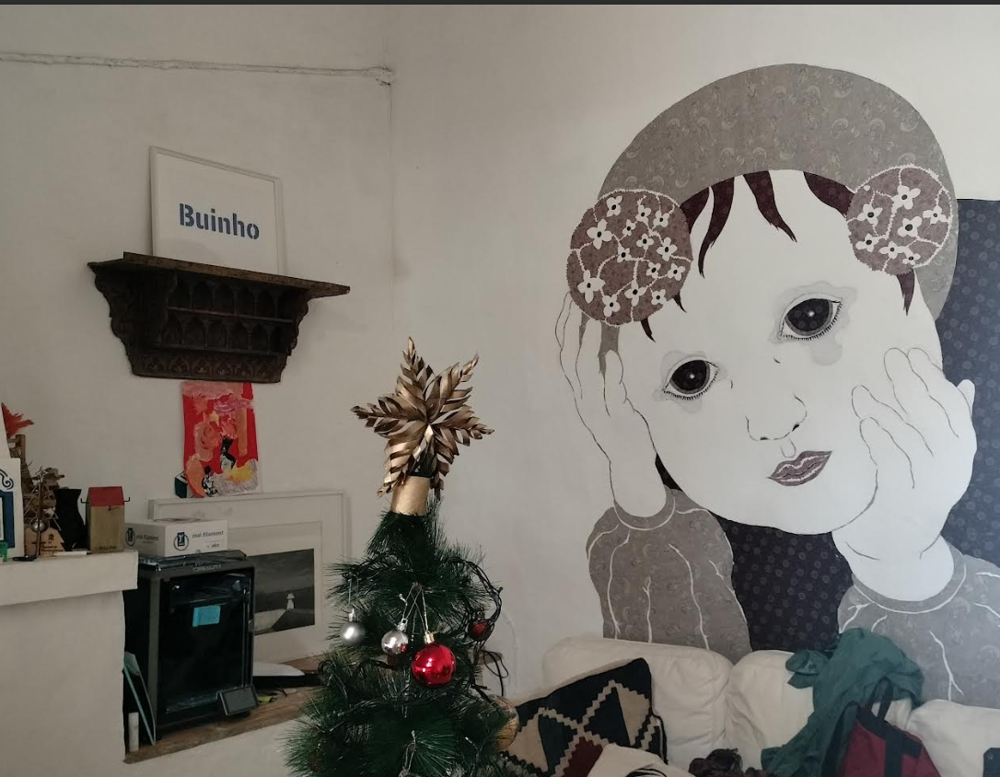
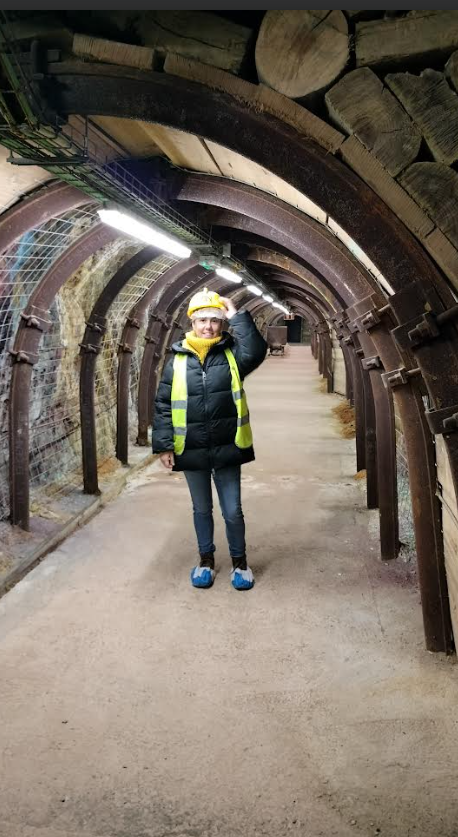
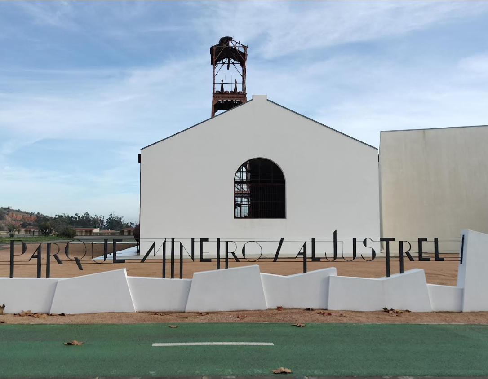
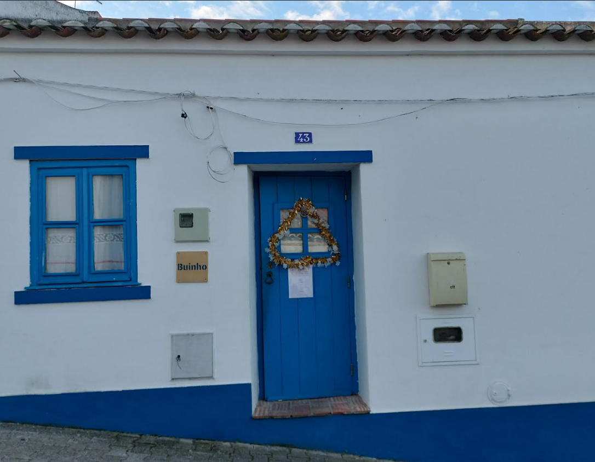

# Inmersión Creativa en el Alentejo con la European Creative Hubs Network

Conexión Europea a través de la European Creative Hubs Network Isabel Fernández, una de nuestras … [Leer más](https://espacioarroelo.es/inmersion-creativa-en-el-alentejo-con-la-european-creative-hubs-network/)

---

## **Conexión Europea a través de la European Creative Hubs Network**

Isabel Fernández, una de nuestras coworkers, tuvo la oportunidad de visitar el sur de Portugal, específicamente el Alentejo, gracias a nuestra participación en la [European Creative Hubs Network ](https://creativehubs.net/)y su programa Hubs Alliance. Este programa es crucial para nuestra comunidad porque permite establecer un diálogo activo y un intercambio de ideas entre espacios creativos de toda Europa. Isabel eligió [Buinho](https://buinho.pt/), un centro creativo en el corazón de Messejana, conocido por su compromiso con la tecnología, la sostenibilidad y las artes. Este viaje representó una oportunidad para expandir horizontes personales y profesionales, y reafirmó nuestro compromiso con la integración y colaboración europea en el sector creativo

## **Explorando el Patrimonio y la Innovación en Buinho**

Durante su estancia en Buinho, Isabel fue acogida calurosamente por Carlos, Sara y todo el equipo de colaboradores, quienes le mostraron el extenso trabajo que realizan. Uno de los aspectos más destacados de su visita fue la exploración de la Interpretación del Patrimonio, una de las áreas clave en Buinho. Isabel tuvo la oportunidad de visitar varios lugares emblemáticos, muchos de ellos parte del patrimonio industrial de la región, lo que le permitió profundizar en la comprensión de cómo el patrimonio inmaterial se entrelaza con la vida comunitaria del territorio. Estas experiencias enriquecieron su conocimiento y perspectiva profesional y le ofrecieron una nueva perspectiva sobre cómo los centros creativos como Buinho funcionan como catalizadores de cambio y desarrollo cultural en las comunidades rurales.

###

## **La Importancia de Crear Alianzas Internacionales**

La experiencia de Isabel subraya la importancia de las alianzas internacionales. Establecer conexiones con otros hubs creativos y centros de innovación es esencial para fomentar un ecosistema creativo más integrado y resiliente en Europa. Este tipo de intercambios enriquece nuestra comprensión y apreciación del trabajo diverso que se realiza en la UE, y fortalece nuestra capacidad de colaborar en proyectos transnacionales que benefician a amplios sectores de la sociedad. Al compartir estas experiencias y aprendizajes, no solo inspiramos a otros personas de nuestra comunidad a buscar oportunidades similares, sino que también demostramos el poder de la colaboración y la red de apoyo que representa la European Creative Hubs Network.

