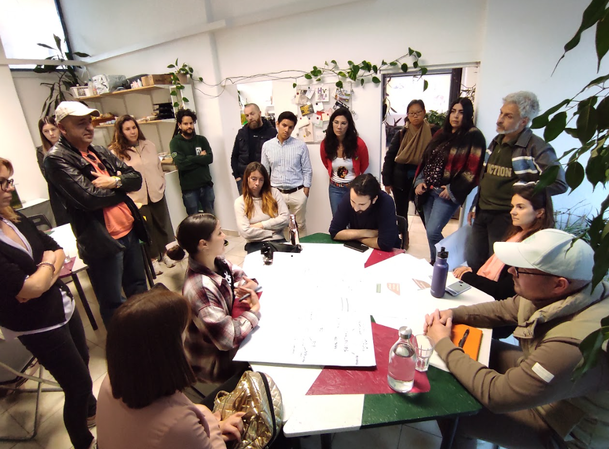
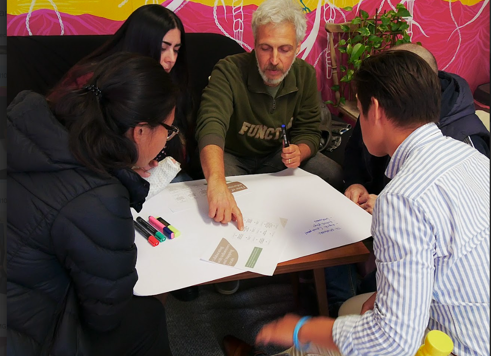
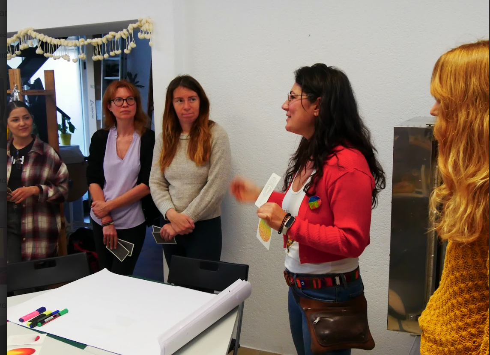
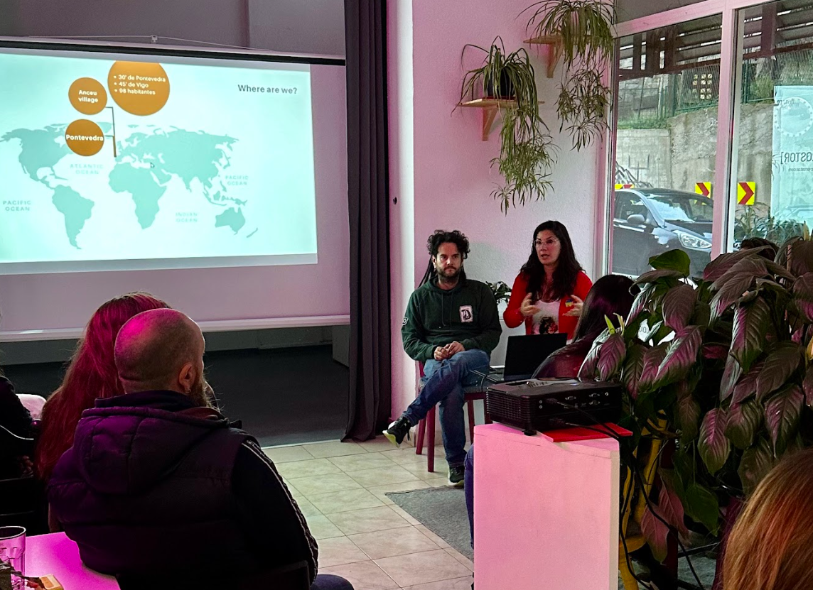
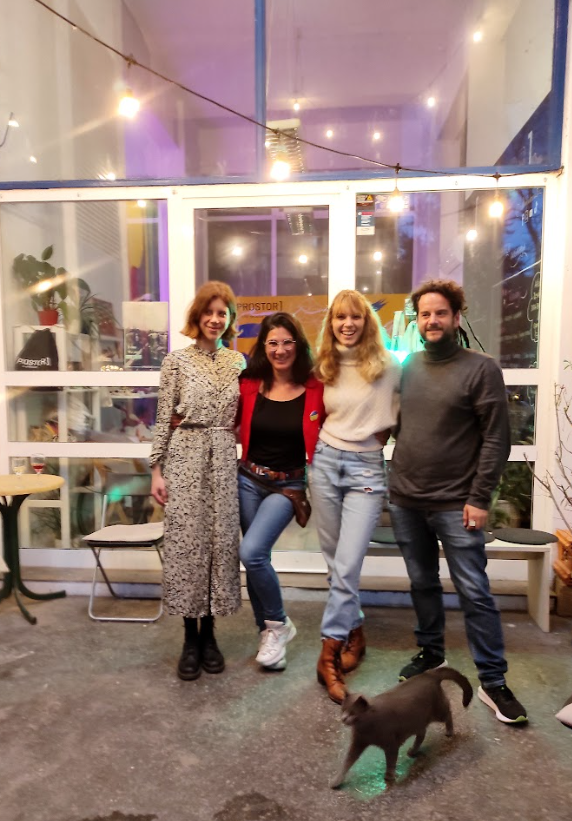
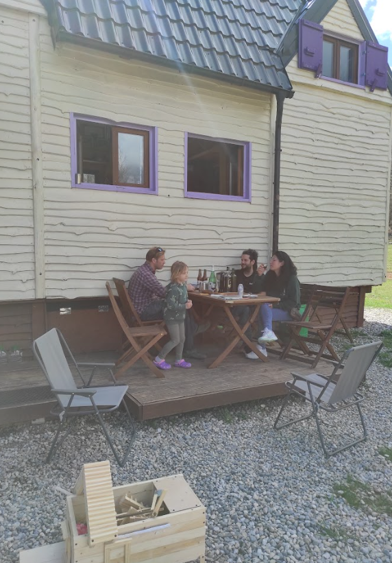
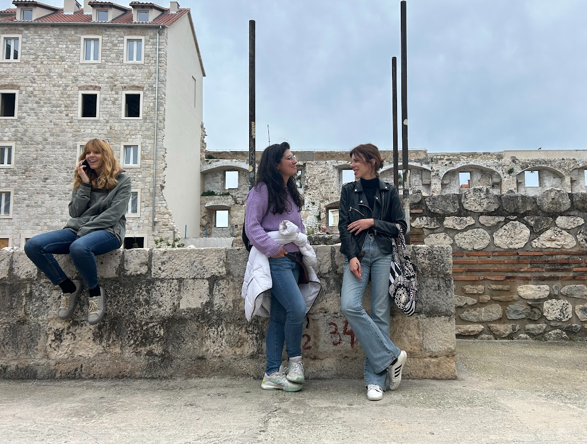
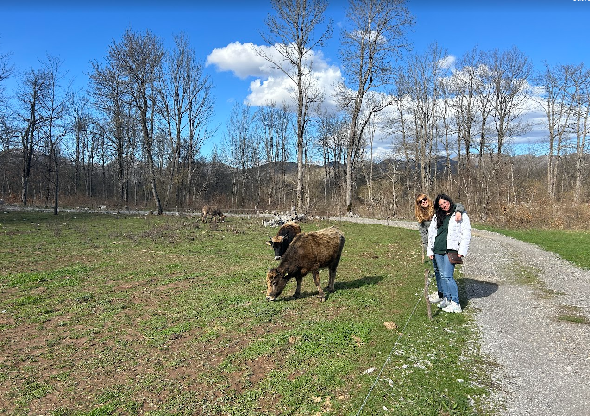

# Intercambio creativo en Croacia

Intercambio Peer to Peer gracias a European Creative Hubs Network Nuestra reciente visita al Culture … [Leer más](https://espacioarroelo.es/intercambio-creativo-en-croacia/)

---

## **Intercambio Peer to Peer gracias a European Creative Hubs Network**

Nuestra reciente visita al [Culture Hub Croatia](https://www.chc-prostor.com/) en la hermosa ciudad de Split fue parte de un intercambio ‘peer-to-peer’ organizado por la [European Creative Hubs Network (ECHN)](https://creativehubs.net/). Esta red es fundamental en Europa para conectar a profesionales y espacios creativos, promoviendo la colaboración y el intercambio de conocimientos en el sector de creatividad, arte y cultura en Europa.

El objetivo de estos intercambios es enriquecer a cada persona de la red a través del aprendizaje mutuo, compartiendo experiencias y explorando nuevas posibilidades colaborativas. Durante nuestra estancia, tuvimos la oportunidad de sumergirnos en el dinamismo de la comunidad local, aprender de sus iniciativas culturales y establecer lazos que trascienden fronteras geográficas y culturales.

## **Creando Puentes entre lo Rural y Urbano**

En el corazón de nuestro viaje a Split estaba el objetivo de integrar la creatividad urbana con los entornos rurales, para lo cual diseñamos un plan detallado que incluyó un evento centrado en esta temática. Nuestro enfoque durante la visita fue cómo adaptar proyectos urbanos creativos para fomentar el desarrollo en áreas rurales.

Uno de los momentos más destacados fue nuestra visita a un proyecto en un pueblo cercano, donde una familia croata está revitalizando su comunidad a través de la permacultura y el desarrollo artístico y cultural. Esta iniciativa nos ofreció una ventana única a las posibilidades de la vida rural dinámica y sostenible, inspirándonos profundamente y permitiéndonos aprender de métodos de vida alternativos que pueden ser adaptados en otros contextos.

Además, compartimos experiencias y estrategias de Espacio Arroelo sobre cómo sus proyectos urbanos han beneficiado a comunidades rurales, con talleres interactivos que exploraron la adaptación de estas iniciativas al contexto rural croata. Esto no solo enriqueció nuestro entendimiento, sino que también nos equipó con ideas aplicables para futuros proyectos de desarrollo rural.

## **El comienzo de futuros proyectos**

El intercambio culminó con una sesión de brainstorming productiva, donde se desarrollaron planes y estrategias concretas para la implementación de iniciativas creativas en entornos rurales croatas. Este evento generó un rico intercambio de conocimientos y estableció las bases para futuras colaboraciones.

Los resultados obtenidos han sido tremendamente positivos, mostrando un incremento notable en el interés y la participación en nuestros futuros programas sobre esta temática. Deseamos expresar nuestro más profundo agradecimiento a todos los participantes, especialmente al equipo de Culture Hub Croatia, por su cálida acogida, su entusiasmo y su compromiso con el intercambio fructífero de ideas.

Este intercambio ha sido una verdadera prueba del valor de la conexión y el aprendizaje mutuo a través de las fronteras culturales y profesionales, y seguimos comprometidas con la misión de fortalecer estas dinámicas en futuros proyectos.

#echn #creativehubs #peer2peer

