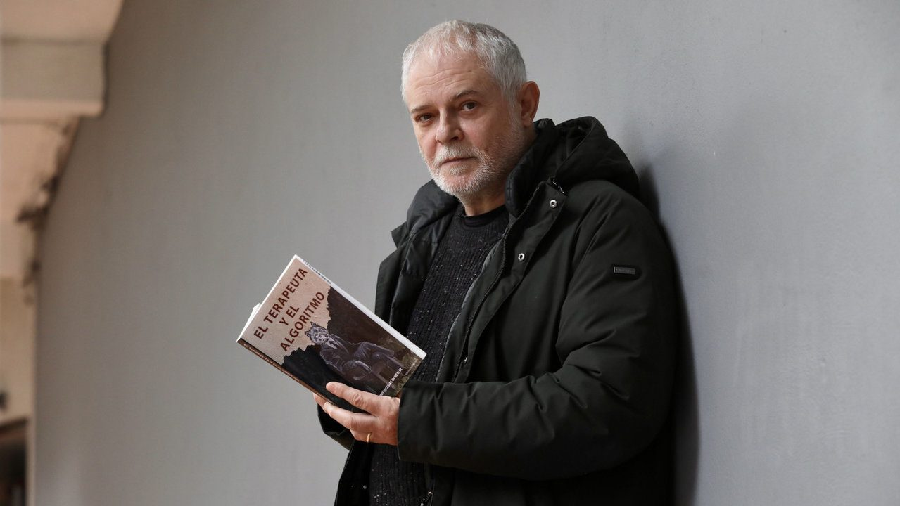

# Mario Iglesias, »EL TERAPEUTA Y EL ALGORITMO».

Quién es Mario Iglesias? Mario Iglesias González es un cineasta y pintor gallego, nacido en … [Leer más](https://espacioarroelo.es/mario-iglesias-el-terapeuta-y-el-algoritmo/)

---

## Quién es Mario Iglesias?

Mario Iglesias González es un cineasta y pintor gallego, nacido en Pontevedra en el año 1962.

En 1990 comenzó con cortometrajes, consiguiendo posteriormente varios premios. Desde 2002 se dedica a ser director de cine y autor. Su obra se caracteriza por una lengua propia basada en los conceptos de realismo y naturalismo.

Después de una década, en 2023 presentó su proyecto *As fillas de Isaura* en el [Festival de Cans](https://www.festivaldecans.gal/gl/).

En diciembre de 2023, publica su obra literaria más reciente, »El terapeuta y el algoritmo», del que hablaremos a continuación.

## El terapeuta y  el algoritmo.

 En esta ocasión, nos adentramos en las páginas de su libro más reciente, titulado «[El Terapeuta y el Algoritmo](https://www.amazon.es/EL-TERAPEUTA-Y-ALGORITMO/dp/B0CPMLG1WF)«, una obra que promete cautivar a todos aquellos ávidos de historias que desafíen los límites de lo convencional.

[Mario Iglesias,](https://gl.wikipedia.org/wiki/Mario_Iglesias) reconocido por su estilo narrativo único y su habilidad para explorar temas profundos, nos invita a adentrarnos en un mundo donde la tecnología y la psicología se entrelazan de manera magistral. En esta obra, Iglesias nos presenta a personajes complejos cuyas vidas se entrelazan de formas inesperadas, mientras exploran los dilemas éticos y emocionales que surgen en un mundo cada vez más dominado por la inteligencia artificial.

A través de una prosa cautivadora y un ritmo narrativo envolvente, el escritor nos sumerge en una trama llena de giros inesperados y reflexiones profundas. ¿Qué sucede cuando las máquinas comienzan a emular las habilidades terapéuticas de los humanos? ¿Cuál es el verdadero significado de la empatía en un mundo cada vez más digitalizado? Estas son algunas de las preguntas que el autor nos plantea, invitándonos a reflexionar sobre el futuro de la humanidad y el papel que la tecnología juega en nuestras vidas.

Pero más allá de ser una novela sobre el futuro, [«El Terapeuta y el Algoritmo»](https://www.amazon.es/EL-TERAPEUTA-Y-ALGORITMO/dp/B0CPMLG1WF) es también un reflejo de las preocupaciones y dilemas contemporáneos. A medida que seguimos los pasos de los personajes de Iglesias, nos vemos obligados a cuestionar nuestras propias creencias y prejuicios, confrontando temas como la identidad, la intimidad y la conexión humana en la era digital.

En resumen, es una obra maestra que combina la intriga de un thriller con la profundidad de una novela filosófica. Con su narrativa inteligente y sus personajes inolvidables, [Mario Iglesias](https://gl.wikipedia.org/wiki/Mario_Iglesias) nos demuestra una vez más por qué es uno de los escritores más destacados de la actualidad.

A continuación, os dejamos el café a la fresca de Mario Iglesias, en [Espacio Arroelo.](https://espacioarroelo.es)

