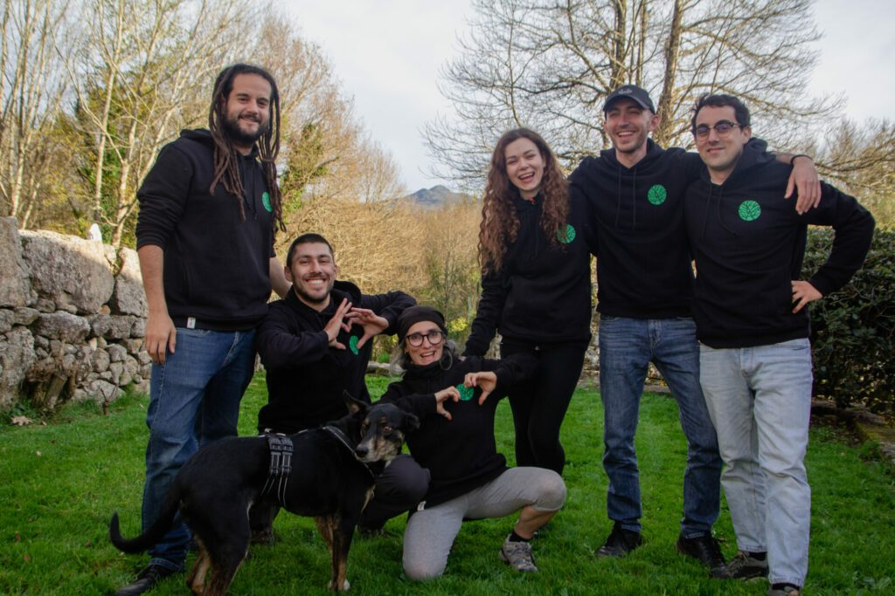
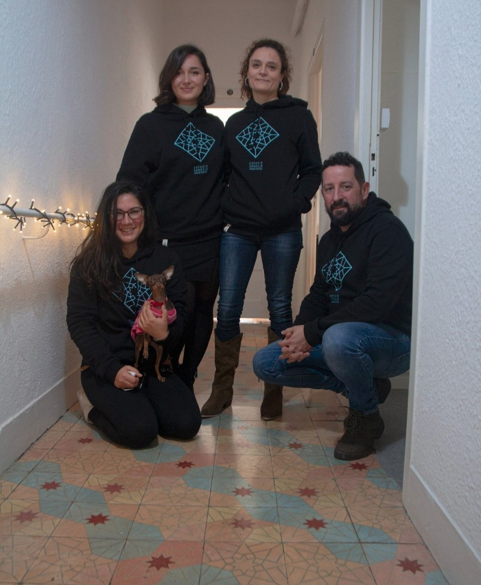

# Merchandising con propósito

Nace Circular Actions Circular ACtions Somos un movimiento formado por 5 empresas y entidades comprometidas … [Leer más](https://espacioarroelo.es/merchandising-con-proposito/)

---

Nace Circular Actions

## Circular ACtions

Somos un movimiento formado por 5 empresas y entidades comprometidas con la sostenibilidad: Anceu Coliving, Espacio Arroelo, Eleven Yellow, A Rente do Chan y Loba e Oso. Juntas, hemos creado Circular Actions.

Estas acciones abarcan diversos productos, artículos promocionales y actividades, cada uno con características específicas:

- Crecimiento regenerativo que devuelve al entorno natural más de lo que tomamos.

- Consumo de recursos dentro de límites sostenibles.

- Reducción de la huella de carbono.

- Incremento de la tasa de utilización de materiales circulares.

Un porcentaje de las ventas se destina a acciones medioambientales locales, como la plantación de árboles y el enriquecimiento de la fauna.

El equipo de Loba e Oso encuentra materiales ecológicos y gestiona la producción con empresas locales en Pontevedra. Colaboran con A Rente do Chan, una asociación sin fines de lucro dedicada a impulsar acciones para desarrollar políticas forestales y medioambientales en la Galicia Rural.

