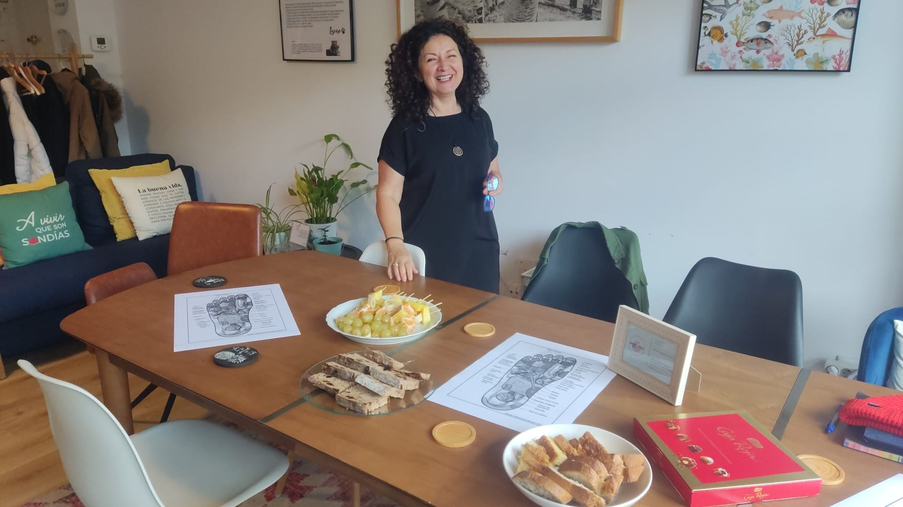

# Reflexología con Isabel Ures.

Qué sabemos de Isa Ures? Isabel Ures se unió a nuestro Espacio Arroelo en el 2021. La … [Leer más](https://espacioarroelo.es/reflexologia-con-isabel-ures/)

---

## Qué sabemos de Isa Ures?

Isabel Ures se unió a nuestro [Espacio Arroelo](https://espacioarroelo.es) en el 2021.

La necesidad de volver a ilusionarse con un nuevo proyecto de vida después de la pandemia le dió la energía para retomar el camino.

Su vida laboral siempre estuvo ligada al Bienestar de las personas. Trabajando tanto en Galicia como en Londres (siendo este su segundo hogar).

Compartir lo aprendido a lo largo de su trayectoria y ahora sumando la Reflejoterapia como herramienta principal .

## ¿Qué es la reflexología para Isa?

La Reflejoterapia ó [Reflexología](https://es.wikipedia.org/wiki/Reflexología) es una terapia alternativa que consta en tratar el cuerpo a través de puntos reflejos en la planta de los piés en este caso, influyendo así en todos los sistemas.

<<Para mi esta frase sería la definición perfecta ¨Devolver al cuerpo su capacidad de autocuración¨>> Nos dice Isa.

Arroelo la acogió y fué para ella apoyo e inspiración. Un lugar seguro desde donde coger fuerza para seguir adelante.

Dar,  recibir, escuchar, comunicar, crecer e inspirarse día a día con sus compañeros y cada martes con nuestros invitados en ¨Café a la Fresca¨

Isabel siempre se ha mostrado muy agradecida a la familia Arroelo, y nosotros agradecidos de tenerla a ella.

A continuación, os dejamos el café a la fresca de Isa explicando un poquito más.

