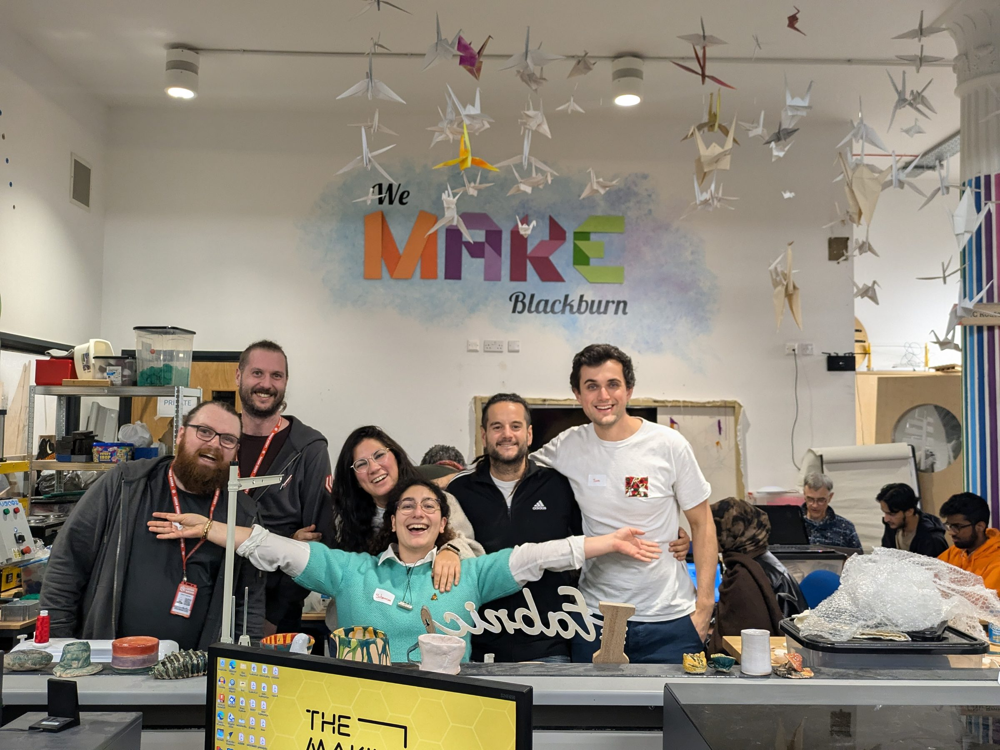
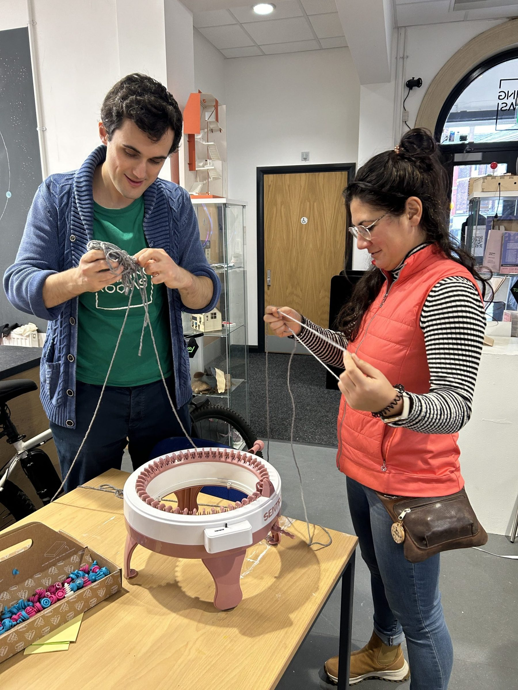
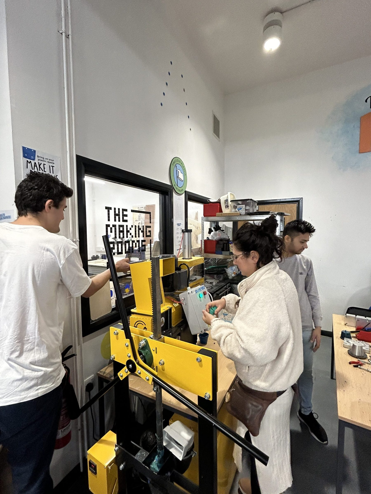
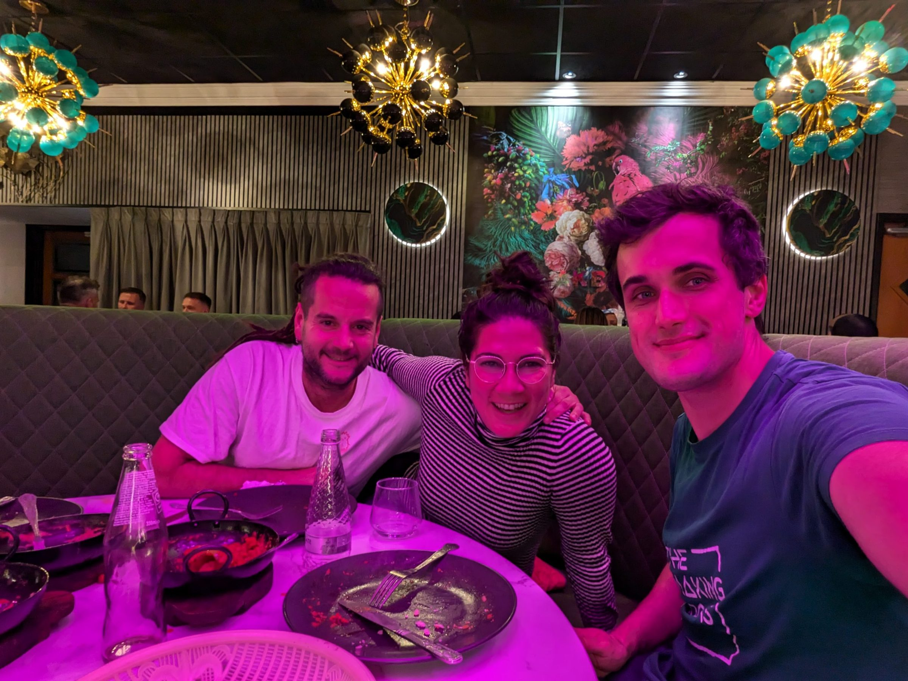
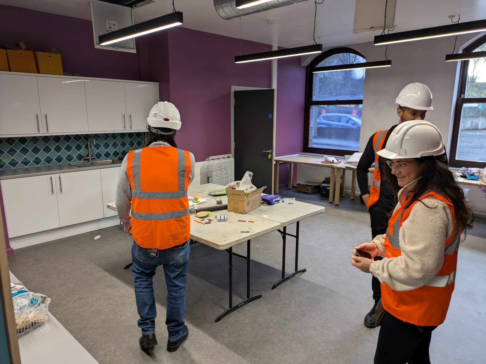
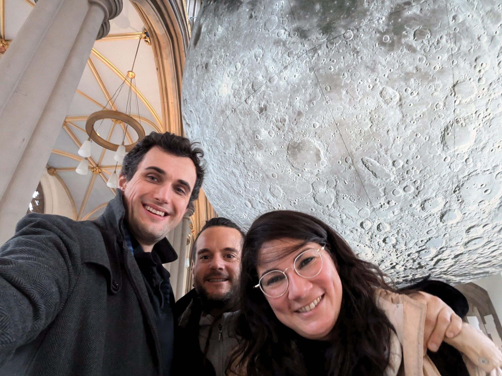
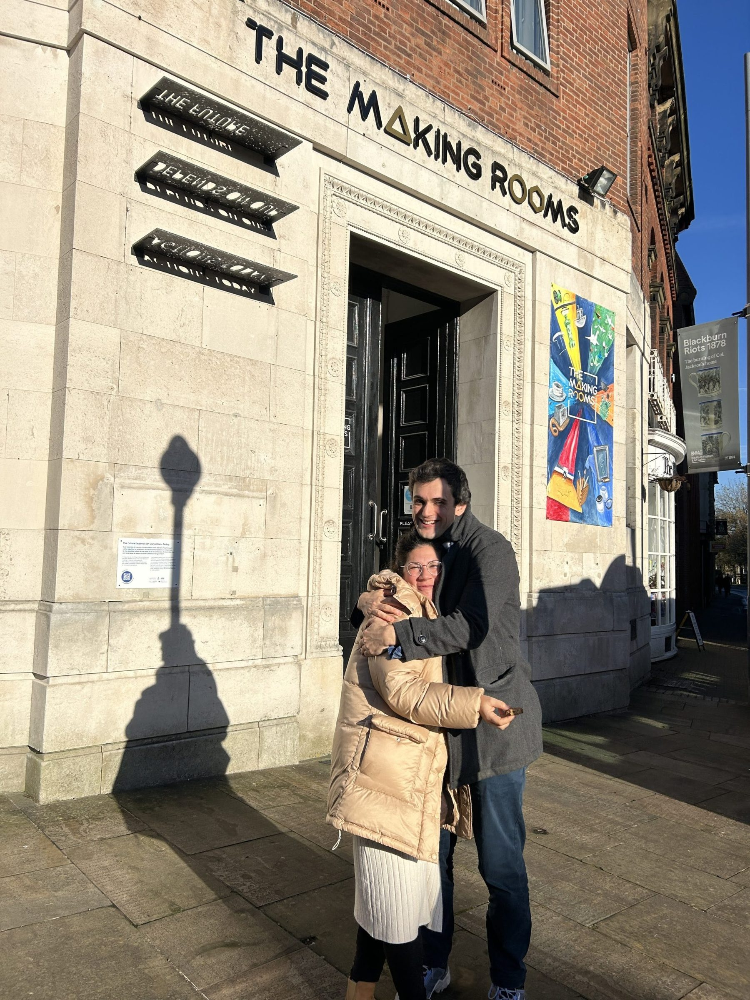
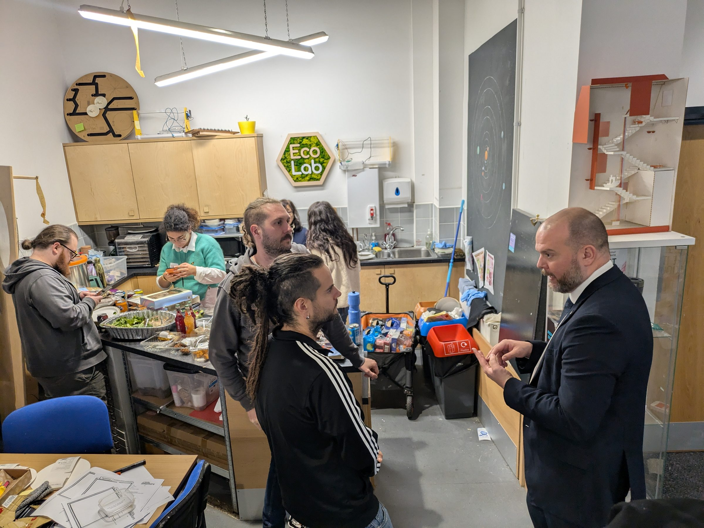

# Un puente de inspiración: Arroelo en Blackburn.

Intercambio Peer to Peer gracias a European Creative Hubs Network En Espacio Arroelo creemos firmemente … [Leer más](https://espacioarroelo.es/un-puente-de-inspiracion-arroelo-en-blackburn/)

---

## **Intercambio Peer to Peer gracias a European Creative Hubs Network**

En Espacio Arroelo creemos firmemente en el poder de las redes internacionales para enriquecer nuestra comunidad y proyectos. Nuestra reciente visita a Blackburn (Reino Unido), como parte de la [European Creative Hub Network,](https://creativehubs.net) nos permitió sumergirnos en un ecosistema vibrante de creatividad, sostenibilidad y compromiso comunitario. A través de nuestra experiencia en [The Making Rooms](https://l.instagram.com/?u=http%3A%2F%2Fwww.makingrooms.org%2F%3Ffbclid%3DPAZXh0bgNhZW0CMTEAAaYWM91gGM5bUvNlwr2gLIYCEizN8ynQk7owbZaNOYMYSOsJGvOsyYywMcA_aem_3UlXnJsl5dlhUdIAovFJgA&e=AT3d3xetNWmmoj0vlYeBY5RLxQALi4WsJ27lGz0xhVNuKAYcTJP5af_Wr9gvK31ZROITcrsL6mFVqNTCmU2xJBgLTE-wxbMX_cC-HA) y otros espacios clave, recopilamos aprendizajes valiosos que fortalecerán nuestras iniciativas en Pontevedra.

## **Innovación y comunidad maker**

**The Making Rooms: innovación y comunidad maker**

Liderado por Tom, **[The Making Rooms](https://l.instagram.com/?u=http%3A%2F%2Fwww.makingrooms.org%2F%3Ffbclid%3DPAZXh0bgNhZW0CMTEAAaYWM91gGM5bUvNlwr2gLIYCEizN8ynQk7owbZaNOYMYSOsJGvOsyYywMcA_aem_3UlXnJsl5dlhUdIAovFJgA&e=AT3d3xetNWmmoj0vlYeBY5RLxQALi4WsJ27lGz0xhVNuKAYcTJP5af_Wr9gvK31ZROITcrsL6mFVqNTCmU2xJBgLTE-wxbMX_cC-HA)** es mucho más que un espacio maker: es un catalizador de proyectos sostenibles y sociales. Durante nuestra visita, exploramos varias iniciativas que combinan tecnología, creatividad y compromiso con el medio ambiente:

**Ecolab**: Este innovador proyecto se centra en reutilizar restos de comida para crear nuevos materiales sostenibles. Aprendimos cómo una mirada creativa puede transformar los desechos en recursos valiosos.

[**Precious Plastics**: ](https://www.preciousplastic.com/)Nos adentramos en el mundo de los plásticos reciclados, creando objetos como macetas y botones a partir de tapas de botellas. También conocimos el proyecto **Replay**, que fomenta el aprendizaje entre jóvenes mediante la reparación de videojuegos, demostrando cómo la sostenibilidad puede convertirse en una herramienta educativa.

**Maquinaria innovadora**: Exploramos herramientas de vanguardia como la máquina CNC y una máquina para hacer calcetines, comprendiendo su potencial para la manufactura artesanal y el desarrollo local.

Además, participamos en un taller comunitario con Nashir, un joven emprendedor, aprendiendo sobre la creación de [posavasos reciclados. ](https://www.facebook.com/STARMAKERS.DARWEN/)

El día en The Making Rooms culminó con un evento comunitario en el que tuvimos el honor de participar. Este espacio, lleno de makers, emprendedores y entusiastas locales, nos permitió intercambiar ideas y presentar los proyectos de Espacio Arroelo y la red europea. Este evento reforzó la importancia de las conexiones internacionales para inspirar y fortalecer iniciativas locales.

**Arte, educación y colaboración en Blackburn**

Blackburn se destaca por su compromiso con el arte y la educación como motores de transformación social. Durante nuestra visita, exploramos espacios que reflejan este espíritu:

- [**Prism Art Gallery**:](https://www.prismcontemporary.co.uk/) Esta galería, dedicada a apoyar a artistas locales, especialmente estudiantes, nos impresionó por su enfoque en la inclusión y el talento emergente. Conocimos a Lidia, una artista local con quien exploramos oportunidades para integrarla en nuestra red europea.

- **[University College of Blackburn](https://blackburn.ac.uk/study/university-centre-blackburn-college)**: En esta institución, profundizamos en sus programas dedicados a artes visuales, fotografía y serigrafía, que fomentan el talento creativo dentro de la comunidad.

- **[Proyecto Lunar](https://blackburncathedral.com/moon/)**: En la catedral de Blackburn nos sorprendió una instalación artística temporal, creada por un artista local, que conecta el arte con el espacio público, transformando la relación de las personas con el entorno urbano.

Además, tuvimos reuniones con representantes del Ayuntamiento de Blackburn, quienes mostraron interés en futuras colaboraciones, ampliando las posibilidades de intercambio cultural y artístico.

#echn #creativehubs #peer2peer

### **[Youth Zone:](https://www.blackburnyz.org/) una ventana al impacto social**

Uno de los momentos más destacados de nuestra visita fue conocer el [**Youth Zone**,](https://www.blackburnyz.org/) un centro juvenil en Blackburn que ofrece actividades que van desde gastronomía y boxeo, hasta tecnología y deportes extremos. Aquí descubrimos una historia particularmente conmovedora: la de una mujer refugiada que, gracias al apoyo del Youth Zone, llegó a representar a los refugiados en los Juegos Olímpicos. Esta experiencia reafirmó nuestro compromiso con la juventud y la importancia de crear espacios inclusivos y oportunidades.

### **Hacia el futuro de Espacio Arroelo**

Nuestra experiencia en Blackburn ha sido transformadora. Nos llevamos ideas concretas para desarrollar en Espacio Arroelo, desde proyectos de sostenibilidad hasta iniciativas de empoderamiento juvenil y artístico. Además, [las conexiones establecidas ](https://leigh.works/)con otros hubs europeos y la comunidad maker de Blackburn abren nuevas puertas para intercambios y colaboraciones.

Blackburn nos mostró el poder de la creatividad y la comunidad para generar impacto. Estas lecciones serán la base para un mayor crecimiento en Espacio Arroelo, conectando lo local con lo global.

Gracias a ECHN por dejarnos formar parte de esta red de profesionales y organizaciones que trabajan incansablemente para crear un futuro más saludable y conectado.
