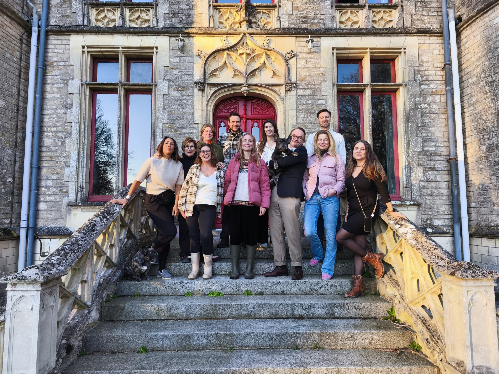
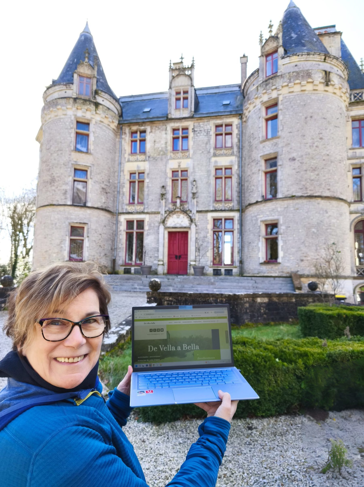
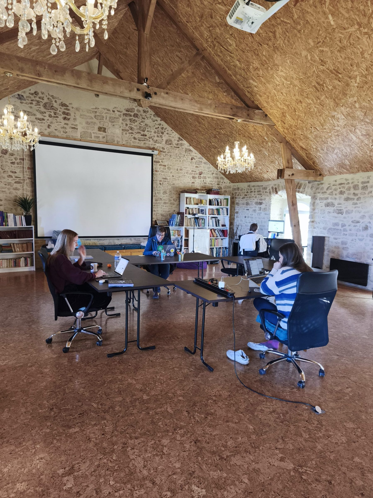
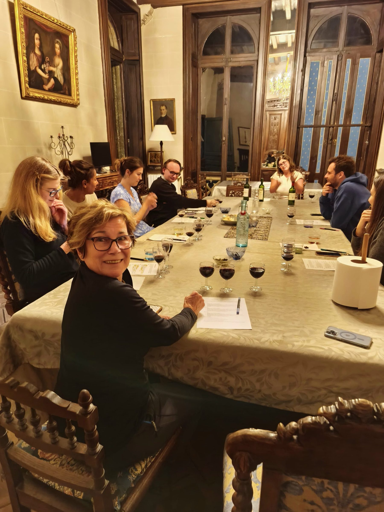
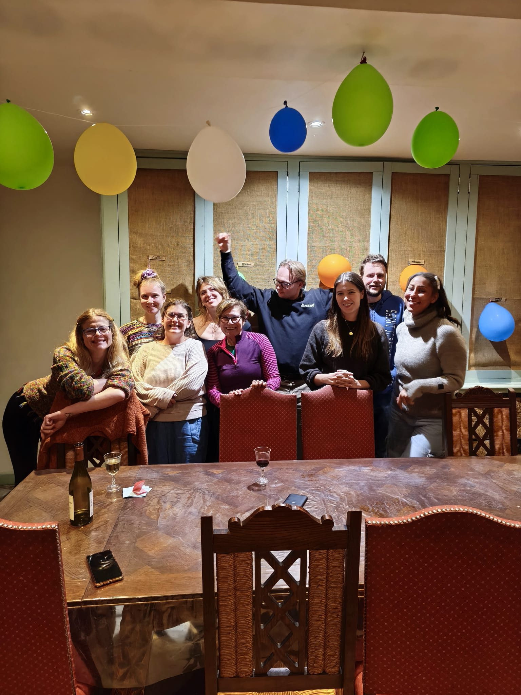
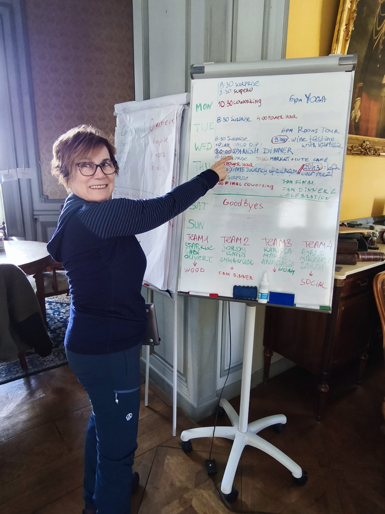
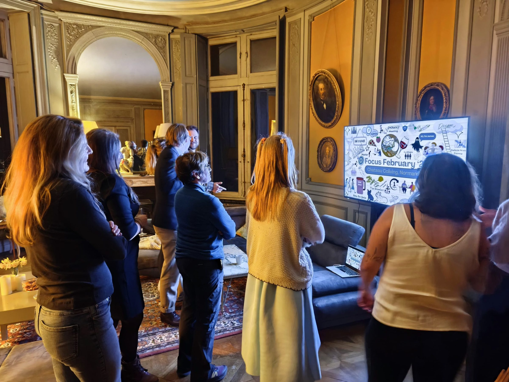
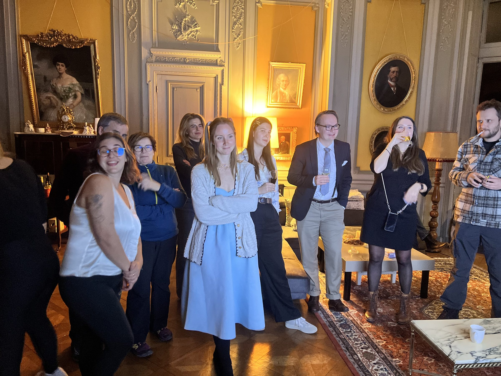

# Una semana en Château Coliving

Intercambio Peer to Peer gracias a European Creative Hubs Network No hay mayor satisfacción que … [Leer más](https://espacioarroelo.es/una-semana-en-chateau-coliving/)

---

## **Intercambio Peer to Peer gracias a European Creative Hubs Network**

No hay mayor satisfacción que poder trabajar desde cualquier lugar del mundo.

Ana nos cuenta:

»Eso fue precisamente lo que tuve la suerte de experimentar en la última semana de febrero, cuando viajé al Château Coliving en Picauville, Normandía, Francia. Esta oportunidad llegó gracias a los intercambios entre espacios creativos de Europa (ECNH), una iniciativa que fomenta la movilidad de profesionales para descubrir nuevos entornos de trabajo y conectar con otros colivers.

El Château Coliving no es solo un espacio para trabajar, sino también un punto de encuentro para personas que buscan un estilo de vida más equilibrado y productivo. Durante esta semana, formamos parte del programa de Productividad Consciente, una propuesta diseñada para ayudar a alcanzar objetivos profesionales sin renunciar al bienestar personal. Rodeada de un ambiente inspirador, compartí jornadas de trabajo con otros colivers comprometidos con su desarrollo profesional y personal.

## **Inspiración y convivencia intergeracional en “*Château Coliving*”**

Las actividades programadas fueron un complemento perfecto para las sesiones de trabajo. Por las tardes, aprovechamos para descubrir la zona y participar en experiencias enriquecedoras: una cata de vinos, una visita al mercado semanal del pueblo e incluso el reto de grabar el tradicional baño semanal en las frías aguas del Canal de la Mancha. Además, fui anfitriona de una cena para toda la comunidad, un momento especial para compartir sueños, objetivos e historias de vida alrededor de la mesa.

Esta experiencia reafirma el valor del coliving como modelo que va más allá de un espacio de trabajo. La interacción con profesionales de distintos sectores facilita el aprendizaje continuo, el intercambio de conocimiento y la creación de sinergias que pueden dar lugar a proyectos innovadores. Normandía fue el escenario perfecto para experimentar en primera persona los beneficios de una comunidad comprometida con la colaboración y el crecimiento.

## **Esto es posible por Arroelo, gracias.**

Me gustaría expresar mi agradecimiento a mi espacio de trabajo, Arroelo, por su implicación en la consecución de este intercambio. Experiencias como esta demuestran que el futuro del trabajo es flexible, global y colaborativo. El coliving no es solo una tendencia, sino una realidad que impulsa la creatividad, la productividad y el bienestar.

Sin duda, esta fue una semana inolvidable que confirma el poder de las comunidades creativas como motor de innovación y desarrollo personal.»

#echn #creativehubs #peer2peer

